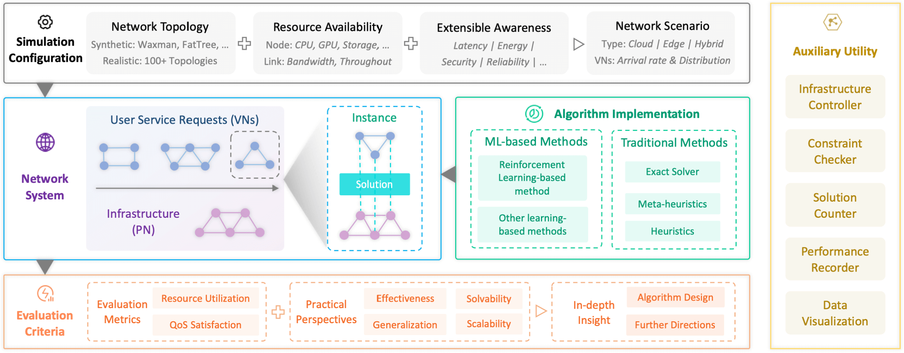

<div align="center">
 
</div>
<div align="center">
<h2 align="center">A Comprehensive Simulator & Benchmark for NFV-RA</h2>
</div>

<div align="center">
   
</div>

<p align="center">
  <a href="resources/pdfs/virne_benchmark_paper.pdf">✨ Benchmark Paper</a> &nbsp;&nbsp;•&nbsp;&nbsp;
  <a href="https://virne.readthedocs.io">Documentation</a> &nbsp;&nbsp;•&nbsp;&nbsp;
  <a href="https://github.com/GeminiLight/virne?tab=readme-ov-file#citations">Citations</a> &nbsp;&nbsp;•&nbsp;&nbsp;
  <a href="https://github.com/GeminiLight/sdn-nfv-papers">SDN-NFV Papers</a>
</p>

--------------------------------------------------------------------------------

**Virne** is a simulator designed to address **resource allocation problems in network function virtualization**. This category of problems is often referred to by various names, including:

- **Virtual Network Embedding (VNE)**
- **Virtual Network Function Placement (VNF Placement)**
- **Service Function Chain Deployment (SFC Deployment)**
- **Network Slicing** and so on.




The main goal of Virne is to provide a unified and flexible framework for solving these problems. Its main characteristics are as follows.

- **Customizable Simulation**: Support various network topologies, network attributes, and QoS requirements.
- **Rich Implementations**: Provide 20+ solvers, including exact, heuristic, meta-heuristic, and machine learning-based algorithms.
- **Extensible Development**: Provide a variety of network topologies, network attributes, and RL environments, which can be easily extended.
        

> [!IMPORTANT]
> :sparkles: We successfully upgrade Virne to **1.0.0** version!
> Our benchmark papers and documentation on Virne will be available soon.
> 
> - Diverse simulations +++
> - Flexible implementations +++
> - Comprehensive evaluations +++
>
> If you have any questions, please open a new issue or contact me via email (wtfly2018@gmail.com)


### Citations

:sparkles: If you find Virne helpful to your research, please feel free to cite our related papers:heart:

**[IJCAI, 2024] FlagVNE** ([paper](https://arxiv.org/pdf/2404.12633) & [code](https://github.com/GeminiLight/flag-vne))

```bibtex
@INPROCEEDINGS{ijcai-2024-flagvne,
  title={FlagVNE: A Flexible and Generalizable Reinforcement Learning Framework for Network Resource Allocation},
  author={Wang, Tianfu and Fan, Qilin and Wang, Chao and Ding, Leilei and Yuan, Nicholas Jing and Xiong, Hui},
  booktitle={Proceedings of the 33rd International Joint Conference on Artificial Intelligence},
  year={2024},
}
```

**[TSC, 2023] HRL-ACRA** ([paper](https://arxiv.org/pdf/2406.17334) & [code](https://github.com/GeminiLight/hrl-acra))

```bibtex
@ARTICLE{tsc-2023-hrl-acra,
  author={Wang, Tianfu and Shen, Li and Fan, Qilin and Xu, Tong and Liu, Tongliang and Xiong, Hui},
  journal={IEEE Transactions on Services Computing},
  title={Joint Admission Control and Resource Allocation of Virtual Network Embedding Via Hierarchical Deep Reinforcement Learning},
  volume={17},
  number={03},
  pages={1001--1015},
  year={2024},
}
```

**[ICC, 2021] DRL-SFCP** ([paper](https://ieeexplore.ieee.org/document/9500964) & [code](https://github.com/GeminiLight/drl-sfcp))

```bibtex
@INPROCEEDINGS{icc-2021-drl-sfcp,
  author={Wang, Tianfu and Fan, Qilin and Li, Xiuhua and Zhang, Xu and Xiong, Qingyu and Fu, Shu and Gao, Min},
  booktitle={ICC 2021 - IEEE International Conference on Communications}, 
  title={DRL-SFCP: Adaptive Service Function Chains Placement with Deep Reinforcement Learning}, 
  year={2021},
  pages={1-6},
}
```

### Table of Contents

- [Quick Start](#quick-start)
  - [Installation](#installation)
    - [Install with pip](#install-with-pip)
    - [Install with script](#install-with-script)
  - [Minimal Example](#minimal-example)
- [Supported Features](#supported-features)
- [Implemented Algorithms](#implemented-algorithms)
  - [Exact Algorithms](#exact-algorithms)
  - [Heuristic Algorithms](#heuristic-algorithms)
  - [Meta-Heuristic Algorithms](#meta-heuristic-algorithms)
  - [Learning-Based Algorithms](#learning-based-algorithms)

## Quick Start

### Installation

1. Create a new conda environment

```bash
conda create -n virne python=3.10
conda activate virne
```

2. Install with script

```bash
# use cpu
bash install.sh -c 0

# use cuda (only support cuda=12.4 and torch=2.6.0)
bash install.sh -c 12.4
```

## Supported Features

- **Diverse Network Topologies for Simulation**
  
  - Simple Network Structures: e.g. Star for Centralized Network, Path for Chain-style Network, etc.
  - Random Network Topologies: e.g. Waxman Graph, Edge Probabilistic Connection Graph, etc.
  - Real-world Network Topologies: e.g. Abilene, Geant, etc.
  
- **Multiple level Attributes for QoS**: 

  - Graph Level: e.g. the global requirements of user service requests, etc.
  - Node level: e.g. computing resource, server position, energy consumption, etc.
  - Link level: e.g. bandwidth resource, communication delay, etc.
  
- **Unified Reinforcement Learning Interface for Extension**
  
  - Provide serval RL Environments in gym.Env-style.
  - Implement the many RL training algorithms, including MCTS, PPO, A2C, etc.
  - Support the integration of RL algorithms from other libraries.
  
- **Various Simulation Scenarios**
  
  - Admission control: Early Reject some not cost-effective service requests.
  - Cloud-Edge: Heteregenous infrastructure with different QoS provision.
  - Time window: Globally process the a batch service requests in a time window.

- **Predefined QoS Awarenesses** (Additional Constraints/ Objectives)

  - [x] Position (Node level)
  - [x] Latency (Graph, Node and Link level)
  - [x] Security (Graph, Node and Link level)
  - [ ] Congestion (Graph, Node and Link level)
  - [ ] Energy (Graph, Node and Link level)
  - [x] Reliability (Graph, Node and Link level)
  - [ ] Dynamic (Graph, Node and Link level)
  - [ ] Parallelization
  - [ ] Privacy


## Implemented Algorithms

**Virne** has implemented the following heuristic-based and learning-based algorithms:

> Mapping Strategies
> - Two-Stage
>   - In this fromework, the VNE solving process are composed of Node mapping and Edge Mapping.
>   - Firstly, the node mapping solution is generate with node mapping algorithm, i.e., Node Ranking
>   - Secondly, the BFS algorithm is employed to route the physical link pairs obtained from the node mapping solution. 
> - Joint Place and Route
>   - The solution of node mapping consists of a sequential placement decision.
>   - Simultaneously, the available physical link pairs are routed by BFS algorithm.
> - BFS Trails
>   - Based on breadth-first search, it expands the search space by exploiting the awareness of restarts.

### Learning-based Solvers

| Name                           | Command                | Type         | Mapping  | Title                                                        | Publication    | Year | Note |
| ------------------------------ | ---------------------- | ------------ | ------------------------------------------------------------ | -------------- | ---- | ---- | ------------------------------ |
| PG-CNN2 | `pg_cnn2` | `learning`   | `two-stage` | [A Virtual Network EmbeddingAlgorithm Based On Double-LayerReinforcement Learning](https://ieeexplore.ieee.org/document/9500964) | The Computer Journal | 2022 |  |
| A3C-G3C-Seq2Seq* | `a3c_gcn_seq2seq` | `learning` | `joint_pr`   | [DRL-SFCP: Adaptive Service Function Chains Placement with Deep Reinforcement Learning](https://ieeexplore.ieee.org/document/9500964)     | ICC         | 2021 |             |
| PG-CNN-QoS | `pg_cnn_qos` | `learning`   | `two-stage` | [Resource Management and Security Scheme of ICPSs and IoT Based on VNE Algorithm](https://arxiv.org/pdf/2202.01375.pdf) | IoTJ | 2021 |  |
| PG-Seq2Seq      | `pg_seq2seq` | `learning`   | `joint_pr` | [A Continuous-Decision Virtual Network Embedding Scheme Relying on Reinforcement Learning](https://ieeexplore.ieee.org/document/8982091) | TNSM   | 2020 |  |
| GAE-Clustering                    | `gae_clustering`          | `learning`   | `bfs_trials` | [Accelerating Virtual Network Embedding with Graph Neural Networks](https://ieeexplore.ieee.org/document/9269128) | CNSM           | 2020 | Clustering |
| PG-MLP                | `pg_mlp`   | `learning`   | `joint_pr` | [NFVdeep: adaptive online service function chain deployment with deep reinforcement learning](http://ieeexplore.ieee.org/document/9068634/). | IWQOS          | 2019 |  |
| Hopfield-Network          | `hopfield_network` | `learning`   | `two-stage` | [NeuroViNE: A Neural Preprocessor for Your Virtual Network Embedding Algorithm](https://mediatum.ub.tum.de/doc/1449121/document.pdf) | INFOCOM   | 2018 | Subgraph Extraction |
| PG-CNN | `pg_cnn`          | `learning`   | `two-stage` | [A Novel Reinforcement Learning Algorithm for Virtual Network Embedding](https://bura.brunel.ac.uk/bitstream/2438/17673/1/FullText.pdf) | Neurocomputing | 2018 |  |
| MCTS                   | `mcts`              | `learning`   | `two-stage` | [Virtual Network Embedding via Monte Carlo Tree Search](https://www.researchgate.net/profile/Ljiljana-Trajkovic/publication/313873926_Virtual_Network_Embedding_via_Monte_Carlo_Tree_Search/links/5ac0386945851584fa7404f4/Virtual-Network-Embedding-via-Monte-Carlo-Tree-Search.pdf?_sg%5B0%5D=IbJ7vUDENmXiBbfMTzU7pe38Z0gve9tpmZe8Z0178rNWQVa5y6AFGJksV2UA1gPa2Fiohm7X1HzI-1rdAPT5Jg.Edi8Rb3R7d-SAgZ4Jl6Z-AnccOosuWHRn2EFIt8dcGLqnDdaw8vBfh1mKV-HieWT8lpuArIMwCjnyAg4CflgVw.cWgci1nNGkvx6bRqmirSaRRk-bi80Q0gMjvmyL49gbkiYRuKU6Zu1Aswe4xTxC99BNyBH7dYbFH3YyQTzUJczg&_sg%5B1%5D=XE66L-R7TPh36UxeMPExdBq5KyXxwAikDWvZbhvLjlAdwbBQ3MNiZbmBZzwQ0L1ntkXedGL1rZZYqX6LhuHdgQbg5Xi8I7phGNSAPGvh1OJv.Edi8Rb3R7d-SAgZ4Jl6Z-AnccOosuWHRn2EFIt8dcGLqnDdaw8vBfh1mKV-HieWT8lpuArIMwCjnyAg4CflgVw.cWgci1nNGkvx6bRqmirSaRRk-bi80Q0gMjvmyL49gbkiYRuKU6Zu1Aswe4xTxC99BNyBH7dYbFH3YyQTzUJczg&_iepl=) | TCYB           | 2018 | MultiThreading Support |

> `*` means that the algorithm only supports chain-shape virtual networks embedding


### Meta-heuristics Solvers

| Name                           | Command       | Type         | Mapping      | Title                                                        | Publication | Year | Note |
| ------------------------------ | ------------- | ------------ | ------------ | ------------------------------------------------------------ | ----------- | ---- | ------------------------------ |
| NodeRanking-MetaHeuristic          | `**_**`         | `meta-heuristics`   | `joint` | [Virtual network embedding through topology awareness and optimization](https://www.sciencedirect.com/science/article/abs/pii/S1389128612000461) | CN         | 2012 | MultiThreading Support |
| Genetic-Algorithm          | `ga`         | `meta-heuristics`   | `two-stage` | [Virtual network embedding based on modified genetic algorithm](https://link.springer.com/article/10.1007/s12083-017-0609-x#:~:text=Virtual%20network%20embedding%20is%20a,nodes%2C%20the%20goal%20of%20link) | Peer-to-Peer Networking and Applications         | 2019 | MultiThreading Support |
| Tabu-Search          | `ts`         | `meta-heuristics`   | `joint` | [Virtual network forwarding graph embedding based on Tabu Search](https://ieeexplore.ieee.org/document/8171072) | WCSP         | 2017 | MultiThreading Support |
| ParticleSwarmOptimization          | `pso`         | `meta-heuristics`   | `two-stage` | [Energy-Aware Virtual Network Embedding](https://ieeexplore.ieee.org/document/6709811) | TON         | 2014 | MultiThreading Support |
| Ant-Colony-Optimization  | `aco`          | `meta-heuristics` | `joint`     | [Link mapping-oriented ant colony system for virtual network embedding](https://ieeexplore.ieee.org/document/7969445) | CEC         | 2017 | MultiThreading Support |
| AntColony-Optimization  | `aco`          | `meta-heuristics` | `joint`     | [VNE-AC: Virtual Network Embedding Algorithm Based on Ant Colony Metaheuristic](https://www.gta.ufrj.br/ensino/cpe717-2011/VNE-ICC-1.pdf) | ICC         | 2011 | MultiThreading Support |
| Simulated-Annealing  | `sa`          | `meta-heuristics` | `two-stage`     | [FELL: A Flexible Virtual Network Embedding Algorithm with Guaranteed Load Balancing](https://ieeexplore.ieee.org/abstract/document/5962960) | ICC         | 2011 | MultiThreading Support |

**Other Related Papers**
- Particle Swarm Optimization 
  - Xiang Cheng et al. "Virtual network embedding through topology awareness and optimization". CN, 2012.
  - An Song et al. "A Constructive Particle Swarm Optimizer for Virtual Network Embedding". TNSE, 2020.
- Genetic Algorithm
  - Liu Boyang et al. "Virtual Network Embedding Based on Hybrid Adaptive Genetic Algorithm" In ICCC, 2019.
  - Khoa T.D. Nguyen et al. "An Intelligent Parallel Algorithm for Online Virtual Network Embedding". In CITS, 2019.
  - Khoa Nguyen et al. "Efficient Virtual Network Embedding with Node Ranking and Intelligent Link Mapping". In CloudNet, 2020.
  - Khoa Nguyen et al. "Joint Node-Link Algorithm for Embedding Virtual Networks with Conciliation Strategy". In GLOBECOM, 2021.
- Ant Colony Optimization
  - N/A

### Heuristics-based Solvers

| Name                           | Command       | Type         | Mapping      | Title                                                        | Publication | Year | Note |
| ------------------------------ | ------------- | ------------ | ------------ | ------------------------------------------------------------ | ----------- | ---- | ---- |
| PL (Priority of Location)      | `pl_rank`     | `heuristics` | `two-stage`  | [Efficient Virtual Network Embedding of Cloud-Based Data Center Networks into Optical Networks](https://ieeexplore.ieee.org/document/9415134) | TPDS        | 2021 |      |
| NRM (Node Resource Management) | `nrm_rank`    | `heuristics` | `two-stage`  | [Virtual Network Embedding Based on Computing, Network, and Storage Resource Constraints](https://ieeexplore.ieee.org/document/7976281) | IoTJ        | 2018 |      |
| GRC (Global resource capacity) | `grc_rank`    | `heuristics` | `two-stage`  | [Toward Profit-Seeking Virtual Network Embedding Algorithm via Global Resource Capacity](https://ieeexplore.ieee.org/document/6847918) | INFOCOM     | 2014 |      |
| RW-MaxMatch (NodeRank)         | `rw_rank`     | `heuristics` | `two-stage`  | [Virtual Network Embedding Through Topology-Aware Node Ranking](https://dl.acm.org/doi/10.1145/1971162.1971168) | ACM SIGCOMM Computer Communication Review     | 2011 |      |
| RW-BFS (NodeRank)              | `rw_rank_bfs` | `heuristics` | `bfs_trials` | [Virtual Network Embedding Through Topology-Aware Node Ranking](https://dl.acm.org/doi/10.1145/1971162.1971168) | ACM SIGCOMM Computer Communication Review     | 2011 |      |


### Exact Solvers

| Name                                 | Command     | Type      | Mapping   | Title                                                                                                                                               | Publication | Year | Note |
| ------------------------------------ | ----------- | --------- | --------- | --------------------------------------------------------------------------------------------------------------------------------------------------- | ----------- | ---- | ---- |
| MIP (Mixed-Integer Programming)  | `mip` | `exact` | `joint` | [ViNEYard: Virtual Network Embedding Algorithms With Coordinated Node and Link Mapping](https://ieeexplore.ieee.org/document/5951812?arnumber=5951812) | TON         | 2012 |      |
| D-Rounding (Deterministic Rounding) | `d_rounding`   | `exact` | `joint` | [ViNEYard: Virtual Network Embedding Algorithms With Coordinated Node and Link Mapping](https://ieeexplore.ieee.org/document/5951812?arnumber=5951812) | TON         | 2012 |      |
| R-Rounding (Random Rounding)        | `r_rounding`   | `exact` | `joint` | [ViNEYard: Virtual Network Embedding Algorithms With Coordinated Node and Link Mapping](https://ieeexplore.ieee.org/document/5951812?arnumber=5951812) | TON         | 2012 |      |

### Simple Baseline Solvers

| Name                                          | Command             | Mapping      |
| --------------------------------------------- | ------------------- | ------------ |
| Random Rank                                   | `random_rank`       | `two-stage`  |
| Random Joint Place and Route                  | `random_joint_pr`   | `joint_pr`   |
| Random Rank Breath First Search               | `random_bfs_trials` | `bfs_trials` |
| Order Rank                                    | `order_rank`        | `two-stage`  |
| Order Joint Place and Route                   | `order_joint_pr`    | `joint_pr`   |
| Order Rank Breath First Search                | `order_bfs_trials`  | `bfs_trials` |
| First Fit Decreasing Rank                     | `ffd_rank`          | `two-stage`  |
| First Fit Decreasing Joint Place and Route    | `ffd_joint_pr`      | `joint_pr`   |
| First Fit Decreasing Rank Breath First Search | `ffd_bfs_trials`    | `bfs_trials` |


## To-do List

### Environment Modeling

- [ ] `ADD` `Scenario` Window Batch Processing
- [x] `ADD` `Environment` Check Attributes of p_net and v_net
- [x] `ADD` `Environment` Latency Constraint
- [x] `ADD` `Controller` Check graph constraints
- [x] `ADD` `Controller` Multi-commodity flow
- [x] `ADD` `Environment` QoS level Constraints
- [x] `ADD` `Recorder` Count partial solutions' information
- [x] `ADD` `Enironment` Early rejection (Admission control)
- [x] `ADD` `Environment` Multi-Resources Attributes
- [x] `ADD` `Environment` Position Constraint
- [x] `ADD` `Recorder` Count Running physical network nodes

### Algorithm Implementations

| Name            | Command          | Type         | Mapping     | Title                                                        | Publication | Year | Note |
| --------------- | ---------------- | ------------ | ----------- | ------------------------------------------------------------ | ----------- | --------------- | --------------- |
| PG-Conv-QoS-Security | `pg_cnn_qs` | `learning`   | `joint`     | [VNE Solution for Network Differentiated QoS and Security Requirements: From the Perspective of Deep Reinforcement Learning](https://arxiv.org/pdf/2202.01362.pdf) | arXiv        |         | Security |
| DDPG-Attention* | `ddpg_attention` | `learning`   | `joint`     | [A-DDPG: Attention Mechanism-based Deep Reinforcement Learning for NFV](https://research.tudelft.nl/en/publications/a-ddpg-attention-mechanism-based-deep-reinforcement-learning-for-) | IWQOS       | 2021   |  |
| MUVINE          | `mu`        | `learning`   | `joint`     | [MUVINE: Multi-stage Virtual Network Embedding in Cloud Data Centers using Reinforcement Learning based Predictions](https://arxiv.org/pdf/2111.02737.pdf) | JSAC        | 2020    | Admission Control |
| TD      | `td`      | `learning`   | `two-stage` | [VNE-TD: A virtual network embedding algorithm based on temporal-difference learning](https://www.sciencedirect.com/science/article/pii/S138912861830584X?via%3Dihub) | CN          | 2019      |  |
| RNN          | `rnn`         | `learning`   | `two-stage` | [Boost Online Virtual Network Embedding: Using Neural Networks for Admission Control](https://mediatum.ub.tum.de/doc/1346092/1346092.pdf) | CNSM        | 2016    | Admission Control |
