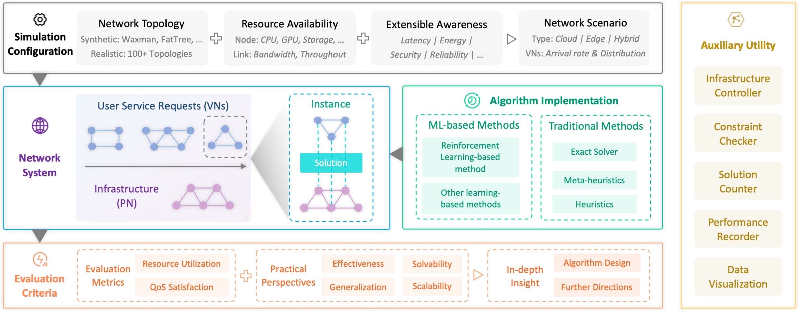

<div align="center">
 
</div>
<div align="center">
<h2 align="center">A Comprehensive Simulator & Benchmark for NFV-RA</h2>
</div>

<div align="center">
<a href="https://deepwiki.com/GeminiLight/virne"></a>
 


</div>
<div align="center">

</div>


<p align="center">
  <a href="https://arxiv.org/abs/2507.19234">✨ Benchmark Paper</a> &nbsp;&nbsp;•&nbsp;&nbsp;
  <a href="https://virne.readthedocs.io">Documentation</a> &nbsp;&nbsp;•&nbsp;&nbsp;
  <a href="https://github.com/GeminiLight/virne?tab=readme-ov-file#citations">Citations</a> &nbsp;&nbsp;•&nbsp;&nbsp;
  <a href="https://github.com/GeminiLight/sdn-nfv-papers">SDN-NFV Papers</a>
</p>


--------------------------------------------------------------------------------

**Virne** is a simulator and benchmark for **resource allocation (RA) in Network Functions Virtualisation (NFV)**, with unified support for traditional and **reinforcement learning (RL)**-based algorithms.

> In the literature, RA in NFV is often termed Virtual Network Embedding (VNE), Virtual Network Function (VNF) placement, service function chain (SFC) deployment, or network slicing in 5G.

Virne offers a unified and comprehensive framework for NFV-RA, with the following key features:

* 1️⃣ **Highly Customizable Simulations**: Simulates diverse network environments (e.g., cloud, edge, 5G), with user-defined topologies, resources, and service requirements.
* 2️⃣ **Extensive Algorithm Suite**: Registers exact, heuristic, meta-heuristic, and learning-based solvers behind a common interface.
* 3️⃣ **Reinforcement Learning Support**: Provides standardized RL pipelines and Gym-style environments for rapid development and benchmarking of RL-based solutions.
* 4️⃣ **In-depth Evaluation Aspects**: Enables insightful analysis beyond effectiveness, covering multiple practicality perspectives (e.g., solvability, generalization, and scalability).

> [!IMPORTANT]
> 🎉 The [Virne benchmark paper](https://arxiv.org/abs/2507.19234) has been accepted at ICLR 2026. Welcome to check it out!
>
> ✨ If you have any questions, please open a new issue or contact me via email (wtfly2018@gmail.com)



### Citations

> ❤️ If you find Virne helpful to your research, please feel free to cite our related papers.

#### Benchmark Paper

**[ICLR, 2026] Virne** ([paper](https://arxiv.org/abs/2507.19234))

```bibtex
@inproceedings{tfwang-2026-virne,
  title={Virne: A Comprehensive Benchmark for RL-based Network Resource Allocation in NFV},
  author={Wang, Tianfu and Deng, Liwei and Chen, Xi and Wang, Junyang and He, Huiguo and Hu, Zhengyu and Wu, Wei and Ding, Leilei and Fan, Qilin and Xiong, Hui},
  booktitle={The Fourteenth International Conference on Learning Representations},
  year={2026},
}
```

#### Algorithmic Papers

**[IJCAI, 2024] FlagVNE** ([paper](https://arxiv.org/pdf/2404.12633) & [code](https://github.com/GeminiLight/flag-vne))

```bibtex
@INPROCEEDINGS{ijcai-2024-flagvne,
  title={FlagVNE: A Flexible and Generalizable Reinforcement Learning Framework for Network Resource Allocation},
  author={Wang, Tianfu and Fan, Qilin and Wang, Chao and Ding, Leilei and Yuan, Nicholas Jing and Xiong, Hui},
  booktitle={Proceedings of the 33rd International Joint Conference on Artificial Intelligence},
  year={2024},
}
```

**[TSC, 2023] HRL-ACRA** ([paper](https://arxiv.org/pdf/2406.17334) & [code](https://github.com/GeminiLight/hrl-acra))

```bibtex
@ARTICLE{tsc-2023-hrl-acra,
  author={Wang, Tianfu and Shen, Li and Fan, Qilin and Xu, Tong and Liu, Tongliang and Xiong, Hui},
  journal={IEEE Transactions on Services Computing},
  title={Joint Admission Control and Resource Allocation of Virtual Network Embedding Via Hierarchical Deep Reinforcement Learning},
  volume={17},
  number={03},
  pages={1001--1015},
  year={2024},
}
```

**[ICC, 2021] DRL-SFCP** ([paper](https://ieeexplore.ieee.org/document/9500964) & [code](https://github.com/GeminiLight/drl-sfcp))

```bibtex
@INPROCEEDINGS{icc-2021-drl-sfcp,
  author={Wang, Tianfu and Fan, Qilin and Li, Xiuhua and Zhang, Xu and Xiong, Qingyu and Fu, Shu and Gao, Min},
  booktitle={ICC 2021 - IEEE International Conference on Communications}, 
  title={DRL-SFCP: Adaptive Service Function Chains Placement with Deep Reinforcement Learning}, 
  year={2021},
  pages={1-6},
}
```

### Table of Contents

- [Quickstart](#quickstart)
  - [Installation](#installation)
  - [Run a Small Experiment](#run-a-small-experiment)
- [Implemented Algorithms](#implemented-algorithms)
  - [Learning-based Solvers](#learning-based-solvers)
  - [Meta-heuristics Solvers](#meta-heuristics-solvers)
  - [Heuristics-based Solvers](#heuristics-based-solvers)
  - [Exact and Rounding Solvers](#exact-and-rounding-solvers)
  - [Simple Baseline Solvers](#simple-baseline-solvers)

## Quickstart

### Installation

The installation script targets Linux and Python 3.10. Clone the repository,
then create and activate a Conda environment:

```bash
git clone https://github.com/GeminiLight/virne.git
cd virne
conda create -n virne python=3.10
conda activate virne
```

Install either the CPU or CUDA 12.4 build:

```bash
# CPU-only PyTorch and PyG
bash install.sh -c cpu

# CUDA 12.4 with PyTorch 2.6.0
bash install.sh -c 12.4
```

Verify the installation from the repository root:

```bash
python -c "import virne; print(virne.__version__)"
```

### Run a Small Experiment

Use a fast heuristic and ten VN requests for the first run. Calling
`python main.py` without overrides starts the larger default RL experiment.

```bash
python main.py \
  solver.solver_name=nrm_rank \
  v_sim_setting.num_v_nets=10 \
  training.use_cuda=false \
  'logger.backends=[console]'
```

The run finishes with `Complete` and writes its resolved configuration,
summary, and per-event records under:

```text
results/virne/nrm_rank/<run-id>/
```

See the [Quickstart](https://virne.readthedocs.io/en/latest/start/running.html)
for Hydra overrides and output details, and the
[solver registry](https://virne.readthedocs.io/en/latest/solver/overview.html)
for every valid solver command.

## Implemented Algorithms

**Virne** has implemented a rich collection of exact, heuristic, meta-heuristic, and learning-based algorithms for NFV-RA. Some representative algorithms are listed below; see the [generated solver registry](https://virne.readthedocs.io/en/latest/solver/overview.html) for every command registered by the current code.

### Learning-based Solvers

| Name                           | Command                | Type         | Mapping  | Title                                                        | Publication    | Year | Note |
| ------------------------------ | ---------------------- | ------------ | ------------------------------------------------------------ | -------------- | ---- | ---- | ------------------------------ |
| PG-CNN2 | `pg_cnn2` | `learning`   | `two-stage` | [A Virtual Network EmbeddingAlgorithm Based On Double-LayerReinforcement Learning](https://ieeexplore.ieee.org/document/9500964) | The Computer Journal | 2022 |  |
| GAE-Clustering                    | `gae_clustering`          | `learning`   | `bfs_trials` | [Accelerating Virtual Network Embedding with Graph Neural Networks](https://ieeexplore.ieee.org/document/9269128) | CNSM           | 2020 | Clustering |
| PG-MLP                | `pg_mlp`   | `learning`   | `joint_pr` | [NFVdeep: adaptive online service function chain deployment with deep reinforcement learning](http://ieeexplore.ieee.org/document/9068634/). | IWQOS          | 2019 |  |
| Hopfield-Network          | `hopfield_network` | `learning`   | `two-stage` | [NeuroViNE: A Neural Preprocessor for Your Virtual Network Embedding Algorithm](https://mediatum.ub.tum.de/doc/1449121/document.pdf) | INFOCOM   | 2018 | Subgraph Extraction |
| PG-CNN | `pg_cnn`          | `learning`   | `two-stage` | [A Novel Reinforcement Learning Algorithm for Virtual Network Embedding](https://bura.brunel.ac.uk/bitstream/2438/17673/1/FullText.pdf) | Neurocomputing | 2018 |  |
| MCTS                   | `mcts`              | `learning`   | `two-stage` | [Virtual Network Embedding via Monte Carlo Tree Search](https://www.researchgate.net/profile/Ljiljana-Trajkovic/publication/313873926_Virtual_Network_Embedding_via_Monte_Carlo_Tree_Search/links/5ac0386945851584fa7404f4/Virtual-Network-Embedding-via-Monte-Carlo-Tree-Search.pdf?_sg%5B0%5D=IbJ7vUDENmXiBbfMTzU7pe38Z0gve9tpmZe8Z0178rNWQVa5y6AFGJksV2UA1gPa2Fiohm7X1HzI-1rdAPT5Jg.Edi8Rb3R7d-SAgZ4Jl6Z-AnccOosuWHRn2EFIt8dcGLqnDdaw8vBfh1mKV-HieWT8lpuArIMwCjnyAg4CflgVw.cWgci1nNGkvx6bRqmirSaRRk-bi80Q0gMjvmyL49gbkiYRuKU6Zu1Aswe4xTxC99BNyBH7dYbFH3YyQTzUJczg&_sg%5B1%5D=XE66L-R7TPh36UxeMPExdBq5KyXxwAikDWvZbhvLjlAdwbBQ3MNiZbmBZzwQ0L1ntkXedGL1rZZYqX6LhuHdgQbg5Xi8I7phGNSAPGvh1OJv.Edi8Rb3R7d-SAgZ4Jl6Z-AnccOosuWHRn2EFIt8dcGLqnDdaw8vBfh1mKV-HieWT8lpuArIMwCjnyAg4CflgVw.cWgci1nNGkvx6bRqmirSaRRk-bi80Q0gMjvmyL49gbkiYRuKU6Zu1Aswe4xTxC99BNyBH7dYbFH3YyQTzUJczg&_iepl=) | TCYB           | 2018 | MultiThreading Support |

### Meta-heuristics Solvers

| Name                           | Command       | Type         | Mapping      | Title                                                        | Publication | Year | Note |
| ------------------------------ | ------------- | ------------ | ------------ | ------------------------------------------------------------ | ----------- | ---- | ------------------------------ |
| Genetic-Algorithm          | `ga_meta`         | `meta-heuristics`   | `two-stage` | [Virtual network embedding based on modified genetic algorithm](https://link.springer.com/article/10.1007/s12083-017-0609-x#:~:text=Virtual%20network%20embedding%20is%20a,nodes%2C%20the%20goal%20of%20link) | Peer-to-Peer Networking and Applications         | 2019 | MultiThreading Support |
| Tabu-Search          | `ts_meta`         | `meta-heuristics`   | `joint` | [Virtual network forwarding graph embedding based on Tabu Search](https://ieeexplore.ieee.org/document/8171072) | WCSP         | 2017 | MultiThreading Support |
| ParticleSwarmOptimization          | `pso_meta`         | `meta-heuristics`   | `two-stage` | [Energy-Aware Virtual Network Embedding](https://ieeexplore.ieee.org/document/6709811) | TON         | 2014 | MultiThreading Support |
| Ant-Colony-Optimization  | `aco_meta`          | `meta-heuristics` | `joint`     | [Link mapping-oriented ant colony system for virtual network embedding](https://ieeexplore.ieee.org/document/7969445) | CEC         | 2017 | MultiThreading Support |
| Simulated-Annealing  | `sa_meta`          | `meta-heuristics` | `two-stage`     | [FELL: A Flexible Virtual Network Embedding Algorithm with Guaranteed Load Balancing](https://ieeexplore.ieee.org/abstract/document/5962960) | ICC         | 2011 | MultiThreading Support |

**Other Related Papers**
- Particle Swarm Optimization 
  - Xiang Cheng et al. "Virtual network embedding through topology awareness and optimization". CN, 2012.
  - An Song et al. "A Constructive Particle Swarm Optimizer for Virtual Network Embedding". TNSE, 2020.
- Genetic Algorithm
  - Liu Boyang et al. "Virtual Network Embedding Based on Hybrid Adaptive Genetic Algorithm" In ICCC, 2019.
  - Khoa T.D. Nguyen et al. "An Intelligent Parallel Algorithm for Online Virtual Network Embedding". In CITS, 2019.
  - Khoa Nguyen et al. "Efficient Virtual Network Embedding with Node Ranking and Intelligent Link Mapping". In CloudNet, 2020.
  - Khoa Nguyen et al. "Joint Node-Link Algorithm for Embedding Virtual Networks with Conciliation Strategy". In GLOBECOM, 2021.
- Ant Colony Optimization
  - N/A

### Heuristics-based Solvers

| Name                           | Command       | Type         | Mapping      | Title                                                        | Publication | Year | Note |
| ------------------------------ | ------------- | ------------ | ------------ | ------------------------------------------------------------ | ----------- | ---- | ---- |
| PL (Priority of Location)      | `pl_rank`     | `heuristics` | `two-stage`  | [Efficient Virtual Network Embedding of Cloud-Based Data Center Networks into Optical Networks](https://ieeexplore.ieee.org/document/9415134) | TPDS        | 2021 |      |
| NRM (Node Resource Management) | `nrm_rank`    | `heuristics` | `two-stage`  | [Virtual Network Embedding Based on Computing, Network, and Storage Resource Constraints](https://ieeexplore.ieee.org/document/7976281) | IoTJ        | 2018 |      |
| GRC (Global resource capacity) | `grc_rank`    | `heuristics` | `two-stage`  | [Toward Profit-Seeking Virtual Network Embedding Algorithm via Global Resource Capacity](https://ieeexplore.ieee.org/document/6847918) | INFOCOM     | 2014 |      |
| RW-MaxMatch (NodeRank)         | `rw_rank`     | `heuristics` | `two-stage`  | [Virtual Network Embedding Through Topology-Aware Node Ranking](https://dl.acm.org/doi/10.1145/1971162.1971168) | ACM SIGCOMM Computer Communication Review     | 2011 |      |
| RW-BFS (NodeRank)              | `rw_rank_bfs` | `heuristics` | `bfs_trials` | [Virtual Network Embedding Through Topology-Aware Node Ranking](https://dl.acm.org/doi/10.1145/1971162.1971168) | ACM SIGCOMM Computer Communication Review     | 2011 |      |


### Exact and Rounding Solvers

| Name                                 | Command     | Type      | Mapping   | Title                                                                                                                                               | Publication | Year | Note |
| ------------------------------------ | ----------- | --------- | --------- | --------------------------------------------------------------------------------------------------------------------------------------------------- | ----------- | ---- | ---- |
| MIP (Mixed-Integer Programming)  | `mip` | `exact` | `joint` | [ViNEYard: Virtual Network Embedding Algorithms With Coordinated Node and Link Mapping](https://ieeexplore.ieee.org/document/5951812?arnumber=5951812) | TON         | 2012 |      |
| D-Rounding (Deterministic Rounding) | `d_round`   | `rounding` | `joint` | [ViNEYard: Virtual Network Embedding Algorithms With Coordinated Node and Link Mapping](https://ieeexplore.ieee.org/document/5951812?arnumber=5951812) | TON         | 2012 |      |
| R-Rounding (Random Rounding)        | `r_round`   | `rounding` | `joint` | [ViNEYard: Virtual Network Embedding Algorithms With Coordinated Node and Link Mapping](https://ieeexplore.ieee.org/document/5951812?arnumber=5951812) | TON         | 2012 |      |

### Simple Baseline Solvers

| Name                                          | Command             | Mapping      |
| --------------------------------------------- | ------------------- | ------------ |
| Random Rank                                   | `random_rank`       | `two-stage`  |
| Random Rank Breadth First Search              | `random_rank_bfs`   | `bfs_trials` |
| Order Rank                                    | `order_rank`        | `two-stage`  |
| Order Rank Breadth First Search               | `order_rank_bfs`    | `bfs_trials` |
| First Fit Decreasing Rank                     | `ffd_rank`          | `two-stage`  |
