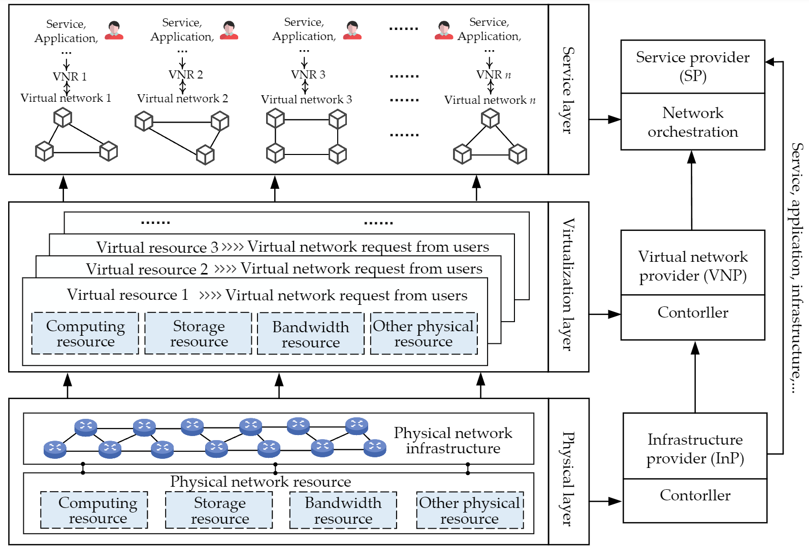

Background
========================================

.. card::
    :class-card: sd-outline-info  sd-rounded-1
    :class-body: sd-font-weight-bold
    
    #. Introduction on Network virtualization
    #. Resource Allocation Problem in NV

Network Virtualization
----------------------

Network virtualization (NV) emerges as a pioneering technology that facilitates dynamic management of Internet architecture.
By decoupling the underlying infrastructure from its logical representation, NV enables the dynamic allocation of network resources, enhancing flexibility, scalability, and efficiency.

NV technology is widely adopted across various network environments, including cloud computing, edge computing, Internet of Things (IoT), and 5G networks, facilitating advanced applications and services in each domain.

.. tab-set::

    .. tab-item:: Cloud computing
        :sync: key1

        .. card::
            :class-header: sd-bg-primary  sd-text-white sd-font-weight-bold
            :class-card: sd-outline-primary  sd-rounded-1
            :class-footer: sd-font-weight-bold

            NV-enabled Cloud computing
            ^^^^^^^^^^^^^^^^^^^^^^^^^^^^^^^^^^^^^^^^^^^^^^^^^^^^^^^^^^^^^^^

            Cloud computing environments are characterized by the vast, scalable resources provided on-demand over the internet. 
            They support a wide range of services, including storage, computing power, and applications.

            NV in cloud computing allows for the efficient utilization of these scalable resources by dynamically allocating virtual networks based on demand. 
            This leads to improved resource management, reduced operational costs, and enhanced service delivery, enabling cloud providers to offer flexible and cost-effective services.
    
    .. tab-item:: Edge computing
        :sync: key2

        .. card::
            :class-header: sd-bg-primary sd-text-white sd-font-weight-bold
            :class-card: sd-outline-primary  sd-rounded-1
            :class-footer: sd-font-weight-bold

            NV-enabled Edge computing
            ^^^^^^^^^^^^^^^^^^^^^^^^^^^^^^^^^^^^^^^^^^^^^^^^^^^^^^^^^^^^^^^
            Edge computing involves processing data closer to the source of data generation rather than relying on a centralized data-processing warehouse. 
            This reduces latency and bandwidth use, making it ideal for applications requiring real-time responses.

            NV enables edge computing by providing flexible network management closer to the data source. 
            It minimizes latency, optimizes bandwidth usage, and ensures efficient resource distribution for edge devices and applications, thereby enhancing the performance and reliability of edge computing solutions.

    .. tab-item:: Internet of Things
        :sync: key3

        .. card::
            :class-header: sd-bg-primary sd-text-white sd-font-weight-bold
            :class-card: sd-outline-primary  sd-rounded-1
            :class-footer: sd-font-weight-bold

            NV-enabled Internet of Things
            ^^^^^^^^^^^^^^^^^^^^^^^^^^^^^^^^^^^^^^^^^^^^^^^^^^^^^^^^^^^^^^^
            The IoT consists of a network of physical devices that communicate and exchange data over the internet. 
            These devices range from everyday household objects to sophisticated industrial tools, all equipped with sensors and software.

            In IoT environments, NV facilitates the seamless integration and management of numerous interconnected devices. 
            It ensures efficient data transmission, real-time processing, and scalability to accommodate the growing number of IoT devices, thus enhancing the overall efficiency and effectiveness of IoT deployments.

    .. tab-item:: 5G Networks
        :sync: key4

        .. card::
            :class-header: sd-bg-primary sd-text-white sd-font-weight-bold
            :class-card: sd-outline-primary  sd-rounded-1
            :class-footer: sd-font-weight-bold

            NV-enabled 5G Networks
            ^^^^^^^^^^^^^^^^^^^^^^^^^^^^^^^^^^^^^^^^^^^^^^^^^^^^^^^^
            5G networks are the next generation of mobile networks, offering significantly higher speeds, lower latency, and more reliable connections. 
            They support a wide range of new applications, including autonomous vehicles, smart cities, and advanced mobile broadband services.

            NV plays a crucial role in 5G networks by enabling network slicing, which allows multiple virtual networks to operate on a single physical infrastructure.
            This enhances network efficiency, supports diverse use cases, and ensures robust performance, thus fully leveraging the capabilities of 5G technology.

Resource Allocation Problem
---------------------------

Under the NV paradigm, both the infrastructure and the services are abstracted into two distinct layers:

- The user service requests are abstracted as **Virtual Network (VNs)** Requests
- The underlying infrastructure is abstracted as a **Physical Network (PN)**.

In practical network systems, users' service requests continuously arrive at the PN. 
The network provider must allocate resources to these requests efficiently while ensuring that the Quality of Service (QoS) requirements are met.

The embedding process of mapping VNs onto the PN is a crucial step in network virtualization, commonly referred to as:

- **Virtual Network Embedding (VNE)**
- **Virtual Network Function Placement (VNF Placement)**
- **Service Function Chain Deployment (SFC Deployment)**

These processes are essential for optimal resource utilization and maintaining service quality in network environments.

.. note::

    This resource allocation process is characterized as a **NP-hard online combinatorial optimization problem**.

**Figure**: Resource Allocation Problem in Network Virtualization. (Source: `COMST'24 - A Survey of AI-powered VNE  <https://ieeexplore.ieee.org/document/10587211>`_)
