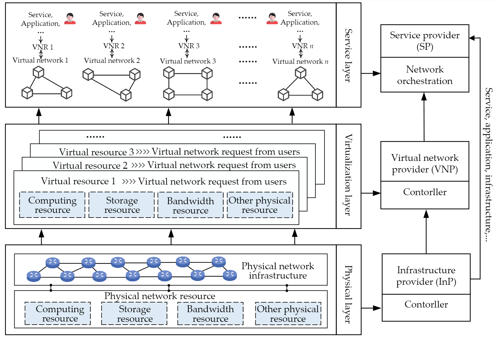

Background & Concepts
=====================

What NFV Means
--------------

**NFV** stands for **Network Functions Virtualisation**. It separates network
functions from the dedicated hardware on which they traditionally run, so that
functions such as firewalls, gateways, and traffic processors can be deployed
and managed as software. This is the definition used by
`ETSI NFV <https://www.etsi.org/technical-groups/nfv/>`_.

NFV should not be confused with the broader term *network virtualization*,
which abstracts network connectivity itself. The two technologies often work
together, but the acronym NFV refers specifically to network **functions**
virtualisation.

The Resource Allocation Problem
-------------------------------

Virne studies how software-defined service requests are allocated to a shared
physical infrastructure. It uses two attributed graphs:

* A **Physical Network (PN)** models servers, links, and their available
  resources, such as CPU and bandwidth.
* A **Virtual Network (VN) request** models the functions or service components
  to deploy, their resource demands, and the connectivity between them.

An NFV-RA solver must place every virtual node on a feasible physical node and
route every virtual link over a feasible physical path. Accepted requests
consume resources for their lifetime; those resources are released when the
requests depart.

**Figure:** A virtual network request is mapped onto physical nodes and paths.
(Source: `COMST'24 - A Survey of AI-powered VNE
<https://ieeexplore.ieee.org/document/10587211>`_.)

Related Problem Names
---------------------

The literature uses several overlapping names for this allocation process:

* **Virtual Network Embedding (VNE)** emphasizes mapping a virtual graph.
* **VNF placement** emphasizes locating individual virtual network functions.
* **Service Function Chain (SFC) deployment** also considers the ordered
  connectivity between functions.
* **Network-slice resource allocation** applies related ideas to isolated
  logical networks, especially in mobile systems.

These problem families are not identical, but they share the same core
placement, routing, and capacity decisions. Virne represents that shared core
with configurable node, link, and graph attributes.

Why It Is Difficult
-------------------

Node placement and link routing are coupled: a good node choice can make
routing easier, while a poor one can make an otherwise feasible request fail.
In an online setting, decisions must also be made without knowing future
arrivals. This combination makes NFV-RA a constrained, NP-hard combinatorial
optimization problem and motivates exact, heuristic, meta-heuristic, and
learning-based solvers.

Continue with the :doc:`formal problem definition <formulation>` or see how
these concepts map to Virne's :doc:`software architecture <framework>`.
