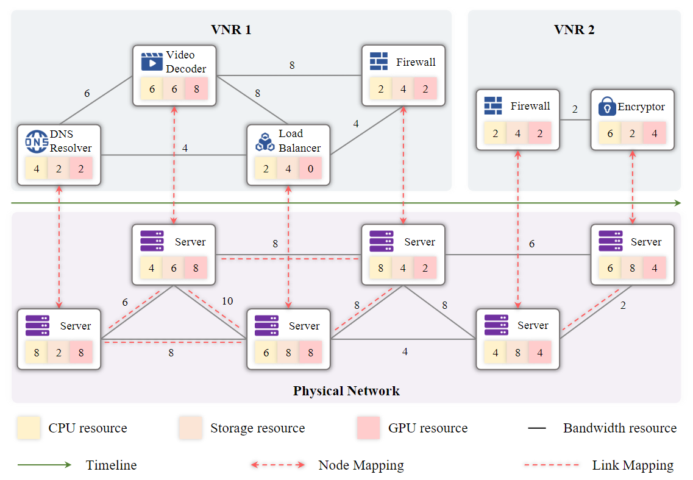

Formulation
============================================

.. card::
    :class-card: sd-outline-info  sd-rounded-1
    :class-body: sd-font-weight-bold

    #. System Model: Physical Network and Virtual Network
    #. Mapping Process: Node Mapping and Link Mapping
    #. Evaluation Metric: Resource Efficiency and QoS Satisfaction

**Figure**: An example of a resource allocation problem in network virtualization. It illustrates the mapping process of virtual network requests onto physical network resources. (Source: `IJCAI'24 - FlagVNE <https://arxiv.org/abs/2404.12633>`_)

System Model
------------
In a practical network system, users' service requests continuously arrive at the underlying infrastructure.

- **Physical Network**: Underlying infrastructure is virtualized as a physical network
- **Virtual Network**: User service requests are virtualized as virtual networks

.. card::
   :class-header: sd-bg-info  sd-text-white sd-font-weight-bold
   :class-card: sd-outline-info  sd-rounded-1
   :class-footer: sd-font-weight-bold

   Physical Network
   ^^^

   The physical network is modelled as a undirected graph :math:`G^p=(N^p, L^p)`, where

   - :math:`N^p` is the set of physical nodes. Each physical node :math:`n^p \in N^p` has a set of computing resources, such as CPU, GPU memory, and bandwidth, which are represented as a vector :math:`C(n^p)`.
   - :math:`L^p` is the set of physical links. Each physical link :math:`l^p \in L^p` has a bandwidth capacity :math:`B(l^p)`.

.. card::
   :class-header: sd-bg-info  sd-text-white sd-font-weight-bold
   :class-card: sd-outline-info  sd-rounded-1
   :class-footer: sd-font-weight-bold

   Virtual Network
   ^^^

   Each virtual network is modelled as a undirected graph :math:`G^v=(N^v, L^v, d^v)`, where

   - :math:`N^v` is the set of virtual nodes. Each virtual node :math:`n^v \in N^v` has a set of resource requirements, such as CPU, GPU memory, and bandwidth, which are represented as a vector :math:`R(n^v)`.
   - :math:`L^v` is the set of virtual links. Each virtual link :math:`l^v \in L^v` has a bandwidth requirement :math:`B(l^v)`.
   - :math:`d^v` is the lifetime of the user service request. Once the VNR is accepted, it will be maintained for :math:`d^v` time slots.

Mapping Process
---------------

The mapping process aims to map the virtual nodes and links onto the substrate network with minimal resource cost while satisfying various QoS constraints.

This graph mapping process :math:`f: G^v \rightarrow G^p` can be divided into two subproblems: node mapping and link mapping.

.. card::
   :class-header: sd-bg-primary  sd-text-white sd-font-weight-bold
   :class-card: sd-outline-primary  sd-rounded-1
   :class-footer: sd-font-weight-bold

   Node Mapping :math:`f_n: N^v \rightarrow N^p`
   ^^^

   Node mapping involves assigning each virtual node :math:`n^v \in N^v` to a physical node :math:`n^p \in N^p`.

   In this process, the following constraints should be satisfied:

   - **One-to-one mapping constraints**: Each virtual node should be mapped to exactly one substrate node.

   .. math::
       :label: formulation-eq-node-1

       f_n(n^v) = n^p, \quad \forall n^v \in N^v

   - **Computing Resource Availability**: The computing resources required by the virtual node should be available on the physical node.

   .. math::
       :label: formulation-eq-node-2

       C(n^p) \geq C(n^v), \quad \forall n^v \in N^v, n^p = f_n(n^v)

.. card::
   :class-header: sd-bg-primary  sd-text-white sd-font-weight-bold
   :class-card: sd-outline-primary  sd-rounded-1
   :class-footer: sd-font-weight-bold

   Link Mapping :math:`f_l: L^v \rightarrow P^p`
   ^^^

   Link mapping involves finding a physical path :math:`p^p \in P^p` for each virtual link :math:`l^v \in L^v`.

   In this process, the following constraints should be satisfied:
    
   - **Link-to-path mapping constraint**: Each virtual link can only be mapped to a path consisting of physical links.
   
   .. math::
       :label: formulation-eq-link-1

       f_l(l^v) = p^p \{l^p_1, l^p_2, \ldots, l^p_k\}, \quad \forall l^v \in L^v

   - **Connectivity constraints**: The mapping should preserve the connectivity of the virtual network, i.e., if there is a virtual link between two virtual nodes, the corresponding physical nodes should be connected by a physical link.

   .. math::
       :label: formulation-eq-link-2

         f_n(n^v_1) = n^p_1, f_n(n^v_2) = n^p_2 \Rightarrow \exists l^p \in L^p, f_l(l^v) = l^p, \quad \forall l^v = (n^v_1, n^v_2) \in L^v

   - **Link resource constraint**:  The sum of the bandwidth requirements of the virtual links mapped to a physical link cannot exceed its capacity.
   
   .. math::
       :label: formulation-eq-link-3

       \sum_{l^v \in L^v, f_l(l^v) = l^p} B(l^v) \leq B(l^p), \quad \forall l^p \in L^p

Evaluation Metric
-----------------

The performance of the mapping process is evaluated based on two types of key metrics from the perspectives of network provider and users.

.. card::
   :class-header: sd-bg-success  sd-text-white sd-font-weight-bold
   :class-card: sd-outline-success  sd-rounded-1
   :class-footer: sd-font-weight-bold

   Resource Efficiency
   ^^^^^^^^^^^^^^^^^^^^

   For the network provider, they aim to maximize the revenue generated by the accepted virtual network requests while minimizing the cost incurred by the mapped virtual networks.

   - **Total Revenue**

   The total revenue measures the obtained revenue of the network provider.
   It is defined as the sum of the revenue generated by the accepted virtual network requests.

   .. math::
       :label: formulation-eq-resource-2

       \text{Total Revenue} = \sum_{n^v \in N^v} \text{Revenue}(n^v) + \sum_{l^v \in L^v} \text{Revenue}(l^v)

   where :math:`\text{Revenue}(n^v)` and :math:`\text{Revenue}(l^v)` are the revenue generated by the virtual node and link, respectively.

   - **Total Cost**

   The total cost measures the cost incurred by the network provider.
   It is defined as the sum of the cost incurred by the mapped virtual networks.

   .. math::
       :label: formulation-eq-resource-4

       \text{Total Cost} = \sum_{n^v \in N^v} \text{Cost}(n^v) + \sum_{l^v \in L^v} \text{Cost}(l^v)

   where :math:`\text{Cost}(n^v)` and :math:`\text{Cost}(l^v)` are the cost incurred by the virtual node and link, respectively.

   - **Revenue-to-Cost Ratio**

   The revenue-to-cost ratio measures the efficiency of the network provider in generating revenue while minimizing the cost.
   It is defined as the ratio of the total revenue to the total cost incurred by the mapped virtual networks.

   .. math::
       :label: formulation-eq-resource-3

       \text{Revenue-to-Cost Ratio} = \frac{\text{Total Revenue}}{\text{Total Cost}}

   where :math:`\text{Total Cost}` is the sum of the cost incurred by the mapped virtual networks.

   - **Resource Utilization**

   The resource utilization measures the efficiency of resource usage in the physical network.
   It is defined as the ratio of the total resources used by the mapped virtual networks to the total resources available in the physical network.

   .. math::
       :label: formulation-eq-resource-1

       \text{Resource Utilization} = \frac{\sum_{n^v \in N^v} R(n^v) + \sum_{l^v \in L^v} B(l^v)}{\sum_{n^p \in N^p} C(n^p) + \sum_{l^p \in L^p} B(l^p)}

.. card::
   :class-header: sd-bg-success  sd-text-white sd-font-weight-bold
   :class-card: sd-outline-success  sd-rounded-1
   :class-footer: sd-font-weight-bold

   QoS Satisfaction
   ^^^^^^^^^^^^^^^^^

   For the network users, they aim to ensure that their service requests are satisfied with the desired QoS requirements.

   - **Acceptance Ratio**

   The acceptance ratio measures the percentage of accepted virtual network requests among all incoming requests.
   It is defined as the ratio of the number of accepted virtual network requests to the total number of incoming requests.

   .. math::
       :label: formulation-eq-qos-1

       \text{Acceptance Ratio} = \frac{\text{Number of Accepted Requests}}{\text{Total Number of Requests}}

   where the number of accepted requests is determined based on the resource availability and QoS constraints.

   - **QoS Violation Ratio**

   The QoS violation ratio measures the percentage of virtual network requests that violate the QoS constraints.
   It is defined as the ratio of the number of violated requests to the total number of requests.

   .. math::
       :label: formulation-eq-qos-2

       \text{QoS Violation Ratio} = \frac{\text{Number of Violated Requests}}{\text{Total Number of Requests}}

   where the number of violated requests is determined based on the QoS constraints.
