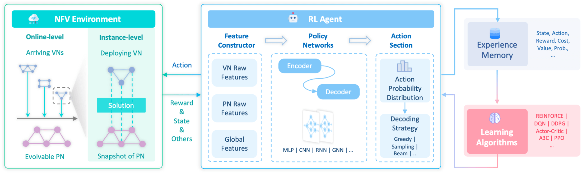

RL Pipeline
===========

Virne provides robust support for deep Reinforcement Learning (RL) based methods to tackle Network Function Virtualization Resource Allocation (NFV-RA) problems. This is achieved through a unified and extensible pipeline, allowing researchers to easily implement, test, and compare various RL agents and architectures. This page details how NFV-RA is modeled as an RL problem within Virne, the architecture of our unified RL pipeline, and an overview of the implemented algorithms and techniques.

NFV-RA as a Markov Decision Process (MDP)
-----------------------------------------

Most existing research, and Virne's primary approach, models the NFV-RA solution construction process as a **Markov Decision Process (MDP)**. In this formulation, an RL agent learns to sequentially select a physical node (or take other relevant actions) to place each virtual node of a given Virtual Network (VN) request, continuing until all virtual nodes are placed or constraints are violated.

The standard MDP for NFV-RA is formally defined by the tuple :math:`(S, A, P, R, \gamma)`:

* **State** (:math:`S`): The state :math:`s_t \in S` at decision step :math:`t` represents the current embedding status of the VN and the available resources in the Physical Network (PN). This includes features of the PN, the VN, and the mapping accomplished so far.

* **Action** (:math:`A`): The action :math:`a_t \in A` typically refers to selecting a physical node :math:`n_p` to host the current virtual node :math:`n_v` being considered. The action space can be adapted based on the specific MDP formulation.

* **State Transition Function** (:math:`P`): :math:`P(s_{t+1} | s_t, a_t)` defines the probability of transitioning from state :math:`s_t` to state :math:`s_{t+1}` after taking action :math:`a_t`.
  
  * If the node placement (action) is feasible, the system attempts to route the virtual links connecting the newly placed virtual node to its already-placed neighbors (often using shortest-path algorithms that satisfy bandwidth and other constraints).
  * If both node placement and link routing are successful, the PN's available resources are updated. Otherwise, the placement step (or the entire VN) might be considered failed or rejected.

* **Reward Function** (:math:`R`): :math:`R(s_t, a_t)` is a scalar reward signal received by the agent after taking action :math:`a_t` in state :math:`s_t`. The reward function is designed to guide the agent towards optimizing the desired NFV-RA objectives (e.g., maximizing resource utilization, acceptance rate, or revenue-to-cost ratio).
  
  * Intermediate rewards can be given for successful partial placements.
  * A final terminal reward is typically provided upon successful embedding of the entire VN or upon failure.

* **Discount Factor** (:math:`\gamma`): :math:`\gamma \in [0, 1)` is the discount factor, which balances the importance of immediate rewards versus future rewards.

The RL Agent's Goal
~~~~~~~~~~~~~~~~~~~

At each decision step :math:`t`, the agent observes the state :math:`s_t` and selects an action :math:`a_t` according to its learned policy :math:`\pi_\theta(a_t | s_t)`, where :math:`\theta` represents the policy parameters (e.g., neural network weights). The environment then transitions to a new state :math:`s_{t+1}` and provides a reward :math:`r_t = R(s_t, a_t)`.

The objective of the agent is to learn an optimal policy :math:`\pi^*` that maximizes the expected cumulative discounted reward:

.. math::

   \pi^* = \arg\max_{\pi} \mathbb{E}_{\tau \sim \pi} \left[ \sum_{t=0}^{T} \gamma^t r_t \right]

where :math:`\tau = (s_0, a_0, r_0, s_1, a_1, r_1, \dots)` is a trajectory of states, actions, and rewards.

.. note::
   While this is the most commonly adopted MDP formulation, Virne is designed to be flexible. It also supports emerging and extended MDP variations tailored for specific aspects of NFV-RA problems. For more details on these variations, please refer to Appendix C.2 of our research paper.

Unified Pipeline for Efficient Implementations
-----------------------------------------------

To streamline the development, comparison, and extension of RL-based NFV-RA methods, Virne implements a **unified and modular pipeline**. This pipeline, conceptually illustrated in Figure 3 of our research paper, standardizes the interaction between the RL agent and the NFV environment.

Key Components of the Pipeline
~~~~~~~~~~~~~~~~~~~~~~~~~~~~~~

1. **NFV Environment (Gym-style)**:
   
   * Provides an instance-level, OpenAI Gym-compatible environment for the RL agent.
   * Manages the PN state, VN requests, and the dynamics of the NFV-RA problem.
   * Processes agent actions, performs feasibility checks (node placement, link routing), updates the state, and calculates rewards.

2. **RL Agent**: The agent learns and makes decisions. It generally consists of:
   
   * **Feature Constructor**: Extracts and preprocesses relevant features from the current state (:math:`s_t`) to create a numerical representation suitable for the policy network. This can include attributes of PN nodes/links, VN nodes/links, and topological features.
   * **Policy Network**: A neural network (parameterized by :math:`\theta`) that takes the constructed features as input and outputs a probability distribution over actions (for stochastic policies) or directly selects an action (for deterministic policies). Virne supports a variety of architectures (see below).
   * **(Optional) Value Network**: In actor-critic methods, a separate network may estimate the value of states or state-action pairs.

3. **Experience Memory**:
   
   * Stores the agent's interaction experiences (trajectories of states, actions, rewards, next states) during training.
   * This data is then sampled by the training algorithm to update the agent's policy. Examples include replay buffers for off-policy algorithms.

4. **Training Algorithm**:
   
   * The core RL algorithm (e.g., PPO, A3C) that uses the collected experiences to optimize the policy network's parameters (:math:`\theta`).
   * Virne allows easy integration of different training algorithms.

5. **Customizable Reward Function**:
   
   * As described in the MDP section, this component provides feedback to the agent at each step or at the end of an episode, guiding the learning process.

Implemented RL-based NFV-RA Algorithms in Virne
------------------------------------------------

Virne offers a comprehensive suite of state-of-the-art and foundational reinforcement learning methods for NFV resource allocation. The framework is designed to flexibly combine various components to construct a wide range of RL agents.

The core building blocks for these algorithms include:

1. RL Training Methods
~~~~~~~~~~~~~~~~~~~~~~

Virne supports several foundational and advanced RL training algorithms to guide the learning process of the neural policies:

* **Policy Gradient (PG / REINFORCE)**: Learns a parameterized policy directly by estimating the gradient of the expected return.
* **Asynchronous Advantage Actor-Critic (A3C)**: An actor-critic method that uses multiple parallel actors to explore the environment, stabilizing learning.
* **Proximal Policy Optimization (PPO)**: A popular and empirically effective actor-critic algorithm known for its stability and data efficiency, achieved by clipping the objective function. (PPO is used as the default RL algorithm in the experiments presented in our research paper).
* **Deep Q-Network (DQN) and variants**: Value-based methods that learn the optimal action-value function (:math:`Q^*`). While NFV-RA often has large, structured action spaces, variations or adaptations can be explored.
* **Monte Carlo Tree Search (MCTS)**: A planning algorithm that can be combined with learned policies/values to improve decision-making by exploring the search tree of possible action sequences.

2. Neural Policy Architectures
~~~~~~~~~~~~~~~~~~~~~~~~~~~~~~~

The neural policy architecture defines how the RL agent perceives the environment (state representation) and decides on actions. Virne implements a range of architectures to capture attribute and structural information in both the PN and VN:

* **Multi-Layer Perceptron (MLP)-based Policy**: A basic feedforward neural network that processes concatenated features of PN and VN elements.
* **Convolutional Neural Network (CNN)-based Policy**: Uses CNNs to process graph-structured data by treating node features and adjacency information as grid-like inputs, or for feature extraction from state representations.
* **Attention-based Policy**: Employs attention mechanisms to weigh the importance of different parts of the input state (e.g., focusing on relevant physical nodes based on the current virtual node's requirements).
* **Graph Convolutional Network (GCN)-based Policy**: Uses GCNs to learn node representations by aggregating information from their local neighborhoods in the PN and/or VN.
* **Graph Attention Network (GAT)-based Policy**: Extends GCNs by incorporating attention mechanisms into the neighborhood aggregation process, allowing nodes to weigh the importance of their neighbors' features.
* **Sequence-to-Sequence (S2S) Models**: Architectures (often RNN-based with attention) used in conjunction with graph encoders (like GCN or GAT) to generate an ordered sequence of actions or placements.
* **Dual Graph Neural Networks (e.g., DualGCN, DualGAT)**: Use two separate GNNs to embed the VN and PN independently, then combine these embeddings for decision-making.
* **Heterogeneous Graph Attention Network (HeteroGAT)-based Policy**: Models the NFV-RA instance as a heterogeneous graph (with different types of nodes and edges) and uses specialized GATs to process this structure.

3. Additional Implementation Techniques
~~~~~~~~~~~~~~~~~~~~~~~~~~~~~~~~~~~~~~~

To enhance learning or address specific challenges in NFV-RA, Virne supports several key techniques:

**Reward Function Design**:

* **No Intermediate Reward (NOIR)**: Agent receives a terminal reward only.
* **Fixed Intermediate Reward (FIR)**: Agent receives a small fixed reward for successful intermediate steps (e.g., placing a node).
* **Adaptive Intermediate Reward (AIR)**: Intermediate reward is normalized (e.g., by VN size).

**Feature Engineering Combinations**:

* **Node Embedding Status**: Flags indicating if a physical node is occupied or if a virtual node is already placed.
* **Topological Features**: Standard graph centrality measures (degree, closeness, betweenness, eigenvector) for PN and VN nodes to augment raw features.

**Action Masking Mechanism**:

* Invalid actions (e.g., placing a VN node on a PN node with insufficient resources or one that violates placement constraints) are explicitly disallowed by masking them out (e.g., setting their selection probability to zero) before action selection. This is vital for navigating complex constraint environments.

.. seealso::
   For a detailed description of each implemented RL method, neural policy variant, and specific implementation techniques, including citations to their original papers, please refer to **Appendix C.3.1** of our research paper. The appendix provides in-depth information on how these components are realized within Virne.