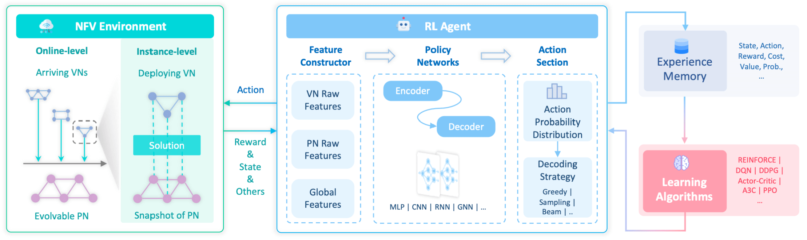

RL Pipeline
===========

Virne models NFV-RA solution construction as a sequential decision problem and
provides reusable components for training and evaluating reinforcement learning
(RL) solvers.

NFV-RA as an MDP
----------------

For the common node-by-node formulation, the Markov Decision Process (MDP) is
defined by :math:`(S, A, P, R, \gamma)`:

* **State** :math:`s_t`: the PN resources, the current VN request, and the
  partial mapping at decision step :math:`t`.
* **Action** :math:`a_t`: usually the physical node selected for the current
  virtual node. Invalid actions can be masked.
* **Transition** :math:`P`: applies placement and routing checks, updates the
  partial solution, and advances to the next virtual node or a terminal state.
* **Reward** :math:`R(s_t, a_t)`: provides intermediate and/or terminal
  feedback based on feasibility and resource efficiency.
* **Discount** :math:`\gamma`: balances immediate and future rewards.

The policy :math:`\pi_\theta(a_t \mid s_t)` is trained to maximize expected
discounted return:

.. math::

   \max_{\theta}\; \mathbb{E}_{\tau \sim \pi_\theta}
   \left[\sum_{t=0}^{T} \gamma^t r_t\right].

How the Pipeline Maps to Code
-----------------------------

1. ``BaseSystem`` generates VN arrival events and passes each instance to the
   selected solver.
2. An instance-level environment constructs a solution one action at a time
   and delegates feasibility checks to the shared controller.
3. The feature constructor converts the current graph state into tensors; the
   policy network selects an action, optionally using an action mask.
4. ``RolloutBuffer`` stores actions, rewards, values, and terminal flags.
5. ``RLSolver`` updates the policy, saves checkpoints, switches to evaluation
   mode, and solves the configured simulation.

This design keeps simulation, feasibility checking, policy architecture, and
training logic separable. Different RL solvers can therefore share the same
network scenarios and evaluation pipeline.

Run a Minimal Training Check
----------------------------

The following CPU command trains ``ppo_dual_gat+`` for one epoch on ten VN
requests, saves a checkpoint, and then evaluates the trained policy:

.. code-block:: bash

   python main.py \
     solver.solver_name=ppo_dual_gat+ \
     v_sim_setting.num_v_nets=10 \
     training.num_train_epochs=1 \
     training.use_cuda=false \
     rl.target_steps=32 \
     'logger.backends=[console]'

.. note::

   This is a pipeline smoke test, not a meaningful benchmark. Research results
   require larger training and evaluation sets, controlled seeds, and the
   protocol described in the benchmark paper.

The final checkpoint is written to:

.. code-block:: text

   results/virne/ppo_dual_gat+/<run-id>/models/model.pkl

Key Training Settings
---------------------

.. list-table::
   :header-rows: 1
   :widths: 34 66

   * - Setting
     - Purpose
   * - ``solver.solver_name``
     - Selects the registered RL solver and policy architecture.
   * - ``training.num_train_epochs``
     - Trains before evaluation when greater than zero.
   * - ``training.use_cuda`` and ``training.gpu_id``
     - Select CPU or a CUDA device.
   * - ``training.save_interval``
     - Controls intermediate checkpoint frequency.
   * - ``rl.target_steps``
     - Sets the rollout size used to trigger an update.
   * - ``rl.gamma`` and ``rl.gae_lambda``
     - Control discounted returns and generalized advantage estimation.
   * - ``rl.reward_calculator``
     - Selects the reward calculation strategy and intermediate reward.
   * - ``rl.feature_constructor``
     - Selects the state features supplied to the policy.
   * - ``rl.mask_actions``
     - Enables or disables invalid-action masking.

Defaults and the remaining optimizer and network settings live in
``settings/main.yaml`` and ``settings/learning.yaml``.

Evaluate a Saved Model
----------------------

Set training epochs to zero and pass an **absolute** checkpoint path:

.. code-block:: bash

   python main.py \
     solver.solver_name=ppo_dual_gat+ \
     training.num_train_epochs=0 \
     solver.pretrained_model_path=/absolute/path/to/model.pkl

Without ``solver.pretrained_model_path``, setting
``training.num_train_epochs=0`` evaluates a randomly initialized RL policy.

See :doc:`../solver/learning` for the RL solver families implemented in Virne
and :doc:`../solver/overview` for the complete registry of valid command names.
