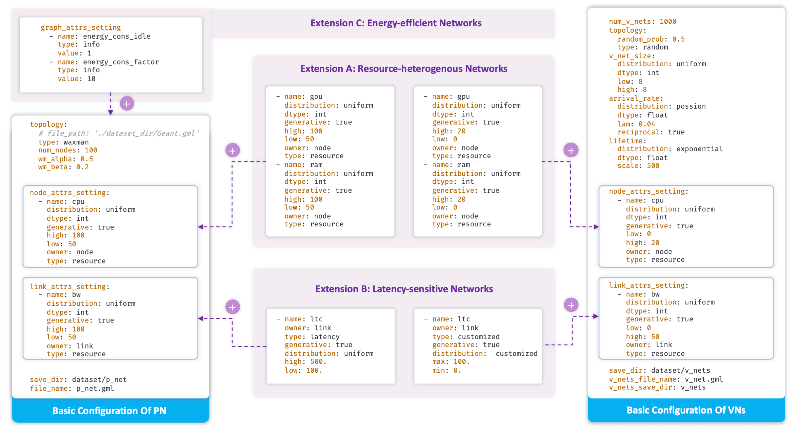

Simulation
==========

Virne offers a highly customizable simulation framework. You can define diverse network scenarios and conditions primarily through **configuration files**. These files grant you detailed control over both the Physical Network (PN) infrastructure and the characteristics of Virtual Network (VN) requests.

This guide outlines the key aspects you can customize.

.. note::
   Figure 4: An example of basic configurations on both PN and VNs, along with their extensions. By adding specific settings on the levels of node, link, or graph, Virne can be easily extended to support emerging networks with additional awareness.

Configuration files typically manage settings for the Physical Network (PN) and parameters for generating Virtual Network (VN) requests.

1. Network Topologies
---------------------
Define the structure of your physical and virtual networks.

Physical Network (PN) Topology
~~~~~~~~~~~~~~~~~~~~~~~~~~~~~~~~
* **Generators**: Use synthetic topology generators like ``Waxman`` or ``FatTree``.
* **Real-world Data**: Virne supports realistic topologies from libraries such as `SNDLib <https://sndlib.put.poznan.pl/>`_ and the `Topology Zoo <http://www.topology-zoo.org/>`_.
* **Specification**: The PN topology is defined within its dedicated section in the configuration file.

Virtual Network (VN) Topology
~~~~~~~~~~~~~~~~~~~~~~~~~~~~~~
* **Generation**: Similar methods to PN topologies can be used.
* **Size**: Configure VN size (number of nodes) often as a distribution (e.g., a uniform distribution like :math:`\chi_{|\mathcal{G}_{v}|}\sim\mathcal{U}(2,10)`).
* **Connectivity**: Set the interconnection probability of virtual nodes within a VN (e.g., 50%).

2. Resource Availability
------------------------
Specify resource types and their capacities across the network.

Resource Types
~~~~~~~~~~~~~~
* **Node-level**: Define computing resources such as ``CPU``, ``GPU``, and ``memory`` for both physical and virtual nodes.
* **Link-level**: Specify network resources like ``bandwidth`` for physical and virtual links.

Availability and Distribution
~~~~~~~~~~~~~~~~~~~~~~~~~~~~~
* **PN Capacities**: Set resource capacities for PN nodes (e.g., CPU :math:`\mathcal{X}_{C(n_{p})}\sim\mathcal{U}(50,100)`) and links (e.g., bandwidth :math:`\mathcal{X}_{B(l_{p})}\sim\mathcal{U}(50,100)`). These often use statistical distributions like uniform or exponential models.
* **VN Demands**: Configure demands for VN node resources (e.g., CPU :math:`\chi_{C(n_{v})}\sim\mathcal{U}(0,20)`) and link bandwidth (e.g., :math:`\chi_{B(l_{w})}\sim\mathcal{U}(0,50)`) in a similar fashion.

3. Service Requirements & Scenario Extensions
---------------------------------------------
Tailor simulations for advanced scenarios by specifying additional service needs. These are often configured within specific attribute settings like ``node_attrs_setting``, ``link_attrs_setting``, or ``graph_attrs_setting``.

Heterogeneous Resources
~~~~~~~~~~~~~~~~~~~~~~~
* **Purpose**: Model environments with diverse computing capabilities (e.g., varied CPU cores, GPU availability).
* **Configuration**: Add new resource types (e.g., ``cpu_type_1``, ``gpu_model_A``) into the ``node_attrs_setting`` section of both PN and VN configuration files.

Latency Constraints
~~~~~~~~~~~~~~~~~~~
* **Importance**: Crucial for time-sensitive networks (e.g., edge computing, 5G).
* **Configuration**: Introduce latency attributes (e.g., ``max_latency_ms`` for VNs, ``propagation_delay_ms`` for PN links) into the ``link_attrs_setting`` section of PN and VN files.

Energy Efficiency
~~~~~~~~~~~~~~~~~
* **Purpose**: Simulate "green" data centers and optimize for sustainability.
* **Configuration**: Include energy consumption parameters (e.g., ``base_power_watts``, ``power_per_cpu_percent``) associated with physical node status (idle/active) and workload in the ``graph_attrs_setting`` or ``node_attrs_setting`` of the PN configuration.

.. note::
   You can also model other service requirements like **reliability** by defining appropriate attributes and ensuring your custom logic or algorithms can interpret them.

4. VN Request Dynamics
----------------------
Configure how Virtual Network requests arrive and behave over time.

Arrival Process
~~~~~~~~~~~~~~~
* **Modeling**: VN arrivals can be modeled using processes like a Poisson process, defined by an average rate (:math:`\lambda` or :math:`\eta`).
* **Adjustment**: This rate may need adjustment based on the PN topology's scale and density to ensure a reasonable load.

Lifetime
~~~~~~~~
* **Definition**: The duration for which an accepted VN remains active in the system.
* **Configuration**: Often follows a statistical distribution, such as an exponential distribution (e.g., an average lifetime of 500 time units).

Configuration File Structure
----------------------------

Virne uses YAML configuration files to define simulation parameters. The framework typically uses separate configuration files for different components, which can be found in the ``settings/`` directory of the project.

.. important::
   The following examples are based on the actual configuration structure used in Virne. Refer to the ``settings/`` directory for complete examples and available options.

**Main Configuration Files:**

* ``p_net_setting.yaml`` - Physical Network configuration
* ``v_sim_setting.yaml`` - Virtual Network simulation settings  
* ``solver.yaml`` - Algorithm and solver configurations

Physical Network Configuration
~~~~~~~~~~~~~~~~~~~~~~~~~~~~~~

.. code-block:: yaml
   :caption: Physical Network Configuration (p_net_setting.yaml)

   # Physical Network Topology
   topology:
     type: 'waxman'  # Options: 'waxman', 'path', 'star', etc.
     num_nodes: 100
     waxman_alpha: 0.5
     waxman_beta: 0.2
     # file_path: 'dataset/topology.gml'  # For real-world topologies

   # Node resource attributes
   node_attrs_setting:
     - name: 'cpu'
       type: 'resource'
       distribution: 'uniform'
       low: 50
       high: 100
     - name: 'ram'
       type: 'resource' 
       distribution: 'uniform'
       low: 50
       high: 100

   # Link resource attributes  
   link_attrs_setting:
     - name: 'bw'
       type: 'resource'
       distribution: 'uniform'
       low: 50
       high: 100

   # Additional network-level attributes
   graph_attrs_setting: []

Virtual Network Simulation Configuration
~~~~~~~~~~~~~~~~~~~~~~~~~~~~~~~~~~~~~~~~~

.. code-block:: yaml
   :caption: Virtual Network Simulation Configuration (v_sim_setting.yaml)

   # VN Request Generation
   num_v_nets: 1000
   
   # Arrival and lifetime patterns
   arrival_rate: 0.16
   lifetime: 
     distribution: 'exponential'
     scale: 500

   # VN topology generation
   topology:
     type: 'erdos_renyi'
     num_v_nodes:
       distribution: 'uniform'
       low: 2
       high: 10
     edge_probability: 0.5

   # Virtual node resource demands
   v_node_attrs_setting:
     - name: 'cpu'
       distribution: 'uniform'
       low: 0
       high: 20
     - name: 'ram'
       distribution: 'uniform'
       low: 0
       high: 20

   # Virtual link resource demands
   v_link_attrs_setting:
     - name: 'bw'
       distribution: 'uniform'
       low: 0
       high: 50

   # VN-level attributes
   v_net_attrs_setting: []

Solver Configuration
~~~~~~~~~~~~~~~~~~~~

.. code-block:: yaml
   :caption: Algorithm Configuration (solver.yaml)

   # Algorithm selection
   solver_name: 'gae_solver'  # Options: 'node_rank', 'topology_aware', etc.
   
   # Algorithm-specific parameters
   reusable: false
   verbose: 1
   
   # For learning-based algorithms
   use_pretrained_model: true
   model_path: 'model/pretrained_model.pkl'

Advanced Configuration Examples
~~~~~~~~~~~~~~~~~~~~~~~~~~~~~~~

**Heterogeneous Resources:**

.. code-block:: yaml
   :caption: Adding GPU resources to nodes

   node_attrs_setting:
     # ...existing code...
     - name: 'gpu'
       type: 'resource'
       distribution: 'bernoulli'  # Some nodes have GPU, others don't
       p: 0.3  # 30% of nodes have GPU
       value_if_true: 8  # Number of GPU cores
       value_if_false: 0

**Latency Constraints:**

.. code-block:: yaml
   :caption: Adding latency requirements to VN links

   v_link_attrs_setting:
     # ...existing code...
     - name: 'max_latency'
       type: 'constraint'
       distribution: 'uniform'
       low: 10
       high: 100
       unit: 'ms'

**Energy Efficiency:**

.. code-block:: yaml
   :caption: Adding power consumption to physical nodes

   node_attrs_setting:
     # ...existing code...
     - name: 'base_power'
       type: 'constraint'
       distribution: 'uniform'
       low: 100
       high: 200
       unit: 'watts'
