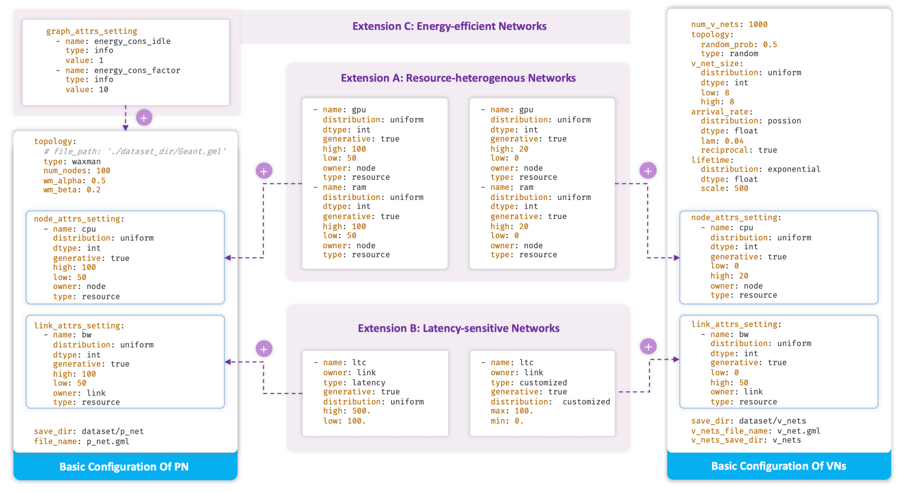

Simulation
==========

Virne offers a highly customizable simulation framework. You can define diverse network scenarios and conditions primarily through **configuration files**. These files grant you detailed control over both the Physical Network (PN) infrastructure and the characteristics of Virtual Network (VN) requests.

This guide outlines the key aspects you can customize.

   Configuration layers for PN/VN generation, network attributes, and
   scenario-specific extensions.

Configuration files typically manage settings for the Physical Network (PN) and parameters for generating Virtual Network (VN) requests.

1. Network Topologies
---------------------
Define the structure of your physical and virtual networks.

Physical Network (PN) Topology
~~~~~~~~~~~~~~~~~~~~~~~~~~~~~~~~
* **Generators**: Use the built-in ``path``, ``star``, ``waxman``, or ``random`` topology generators.
* **Real-world Data**: Virne supports realistic topologies from libraries such as `SNDLib <https://sndlib.put.poznan.pl/>`_ and the Internet Topology Zoo collection, available through the maintained `TopoHub repository <https://github.com/piotrjurkiewicz/topohub>`_.
* **Specification**: The PN topology is defined within its dedicated section in the configuration file.

Virtual Network (VN) Topology
~~~~~~~~~~~~~~~~~~~~~~~~~~~~~~
* **Generation**: Similar methods to PN topologies can be used.
* **Size**: Configure VN size (number of nodes) often as a distribution (e.g., a uniform distribution like :math:`\chi_{|\mathcal{G}_{v}|}\sim\mathcal{U}(2,10)`).
* **Connectivity**: Set the interconnection probability of virtual nodes within a VN (e.g., 50%).

2. Resource Availability
------------------------
Specify resource types and their capacities across the network.

Resource Types
~~~~~~~~~~~~~~
* **Node-level**: Define computing resources such as ``CPU``, ``GPU``, and ``memory`` for both physical and virtual nodes.
* **Link-level**: Specify network resources like ``bandwidth`` for physical and virtual links.

Availability and Distribution
~~~~~~~~~~~~~~~~~~~~~~~~~~~~~
* **PN Capacities**: Set resource capacities for PN nodes (e.g., CPU :math:`\mathcal{X}_{C(n_{p})}\sim\mathcal{U}(50,100)`) and links (e.g., bandwidth :math:`\mathcal{X}_{B(l_{p})}\sim\mathcal{U}(50,100)`). These often use statistical distributions like uniform or exponential models.
* **VN Demands**: Configure demands for VN node resources (e.g., CPU :math:`\chi_{C(n_{v})}\sim\mathcal{U}(0,20)`) and link bandwidth (e.g., :math:`\chi_{B(l_{w})}\sim\mathcal{U}(0,50)`) in a similar fashion.

3. Service Requirements & Scenario Extensions
---------------------------------------------
Tailor simulations for advanced scenarios by specifying additional service needs. These are often configured within specific attribute settings like ``node_attrs_setting``, ``link_attrs_setting``, or ``graph_attrs_setting``.

Heterogeneous Resources
~~~~~~~~~~~~~~~~~~~~~~~
* **Purpose**: Model environments with diverse computing capabilities (e.g., CPU, GPU, and memory availability).
* **Configuration**: Use the built-in ``p_net_setting_multi_resource.yaml`` and ``v_sim_setting_multi_resource.yaml`` configuration groups as the starting point.

Latency Constraints
~~~~~~~~~~~~~~~~~~~
* **Importance**: Crucial for time-sensitive networks (e.g., edge computing and 5G).
* **Configuration**: Use the built-in ``p_net_setting_ltc.yaml`` and ``v_sim_setting_ltc.yaml`` configuration groups, which define link attributes with ``owner: link`` and ``type: latency``.

Custom Constraints
~~~~~~~~~~~~~~~~~~
Energy, reliability, and other constraints are extension points rather than built-in configuration types. Supporting them requires a corresponding attribute implementation and solver logic; adding arbitrary YAML keys alone is not sufficient.

4. VN Request Dynamics
----------------------
Configure how Virtual Network requests arrive and behave over time.

Arrival Process
~~~~~~~~~~~~~~~
* **Modeling**: VN arrivals can be modeled using processes like a Poisson process, defined by an average rate (:math:`\lambda` or :math:`\eta`).
* **Adjustment**: This rate may need adjustment based on the PN topology's scale and density to ensure a reasonable load.

Lifetime
~~~~~~~~
* **Definition**: The duration for which an accepted VN remains active in the system.
* **Configuration**: Often follows a statistical distribution, such as an exponential distribution (e.g., an average lifetime of 500 time units).

Canonical Configuration Files
-----------------------------

The configuration files under ``settings/`` are the source of truth. In particular, refer to:

* `settings/main.yaml <https://github.com/GeminiLight/virne/blob/main/settings/main.yaml>`_ for system, solver, recorder, and logging options.
* `settings/p_net_setting/default.yaml <https://github.com/GeminiLight/virne/blob/main/settings/p_net_setting/default.yaml>`_ for the default physical network.
* `settings/v_sim_setting/default.yaml <https://github.com/GeminiLight/virne/blob/main/settings/v_sim_setting/default.yaml>`_ for the default virtual network request simulation.
* `settings/p_net_setting/ <https://github.com/GeminiLight/virne/tree/main/settings/p_net_setting>`_ and `settings/v_sim_setting/ <https://github.com/GeminiLight/virne/tree/main/settings/v_sim_setting>`_ for the supported scenario variants.

These files are intentionally not duplicated here so that configuration examples cannot drift from the executable defaults.
